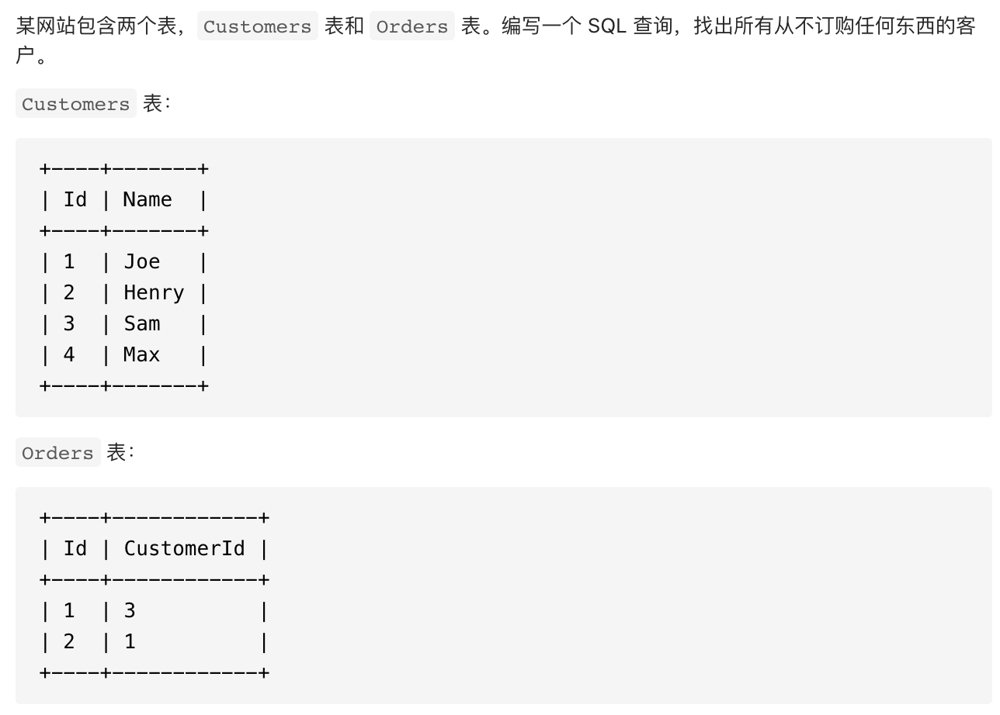
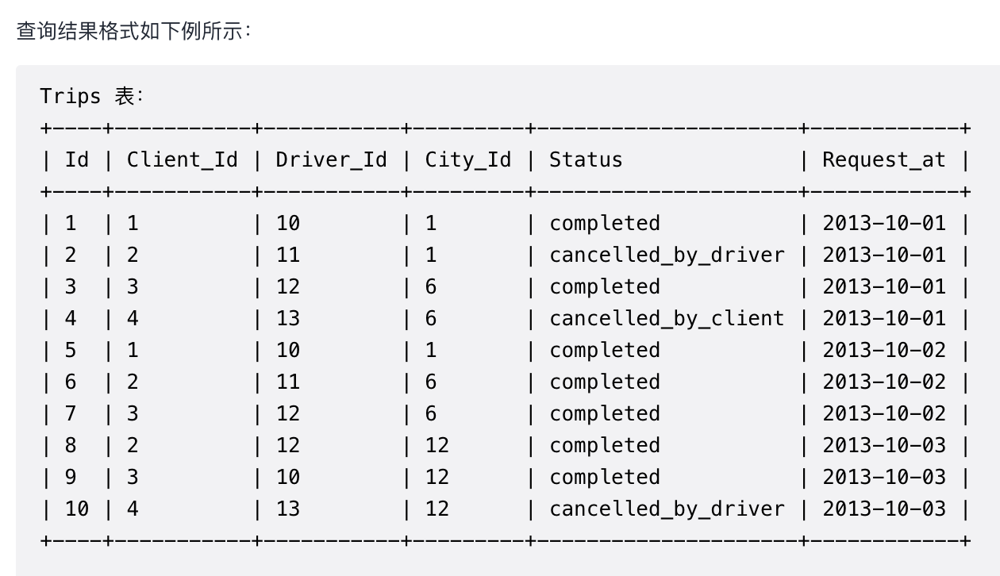
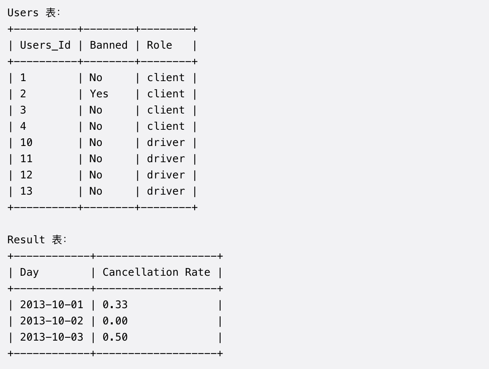

## Leetcode SQL 刷题笔记

### 组合两个表
#### 题目：

编写一个 SQL 查询，满足条件：无论 person 是否有地址信息，都需要基于上述两表提供 person 的以下信息:
`FirstName, LastName, City, State`

#### Solution:
```SQL
SELECT FirstName, LastName, City, State
FROM Person AS P LEFT JOIN Address AS A
ON P.PersonId = A.PersonId
```

#### 题解:
无论 person 是否有地址信息，都需要基于上述两表提供 person 的信息，因此需要LEFT JOIN

---
### 第二高的薪水
#### 题目：


#### Solution:
##### Sol 1:
```SQL
SELECT(SELECT DISTINCT Salary
       From Employee
       ORDER BY Salary DESC
       LIMIT 1 OFFSET 1) 
       AS SecondHighestSalary
```

##### Sol 2:
```SQL
SELECT IFNULL((SELECT DISTINCT Salary
             From Employee
             ORDER BY Salary DESC
             LIMIT 1 OFFSET 1), NULL) 
             AS SecondHighestSalary
```

##### Sol 3:
```SQL
SELECT(SELECT DISTINCT e1.Salary
FROM Employee e1
WHERE (SELECT COUNT(DISTINCT e2.Salary) FROM Employee e2 WHERE e2.Salary >= e1.Salary) = 2) 
AS SecondHighestSalary
```

#### 题解：
* DISTINCT 关键字 排序时选取唯一
* OFFSET 关键字: LIMIT m OFFSET n = LIMIT n,m (注意参数的顺序！都表示跳过n个后取m个)
* 如果想要的字段不存在，用IFNULL或者子查询的方式排除


### 拓展：第n高的薪水
#### 题目


#### Solution:
##### Sol 1: LIMIT 简单粗暴
```SQL
CREATE FUNCTION getNthHighestSalary(N INT) RETURNS INT
BEGIN
SET N := N - 1;
  RETURN (
    SELECT(
    SELECT (SELECT DISTINCT Salary
    FROM Employee
    ORDER BY Salary DESC
    LIMIT N,1))
  );
END
```

##### Sol 2: 子查询效率超低！
```SQL
CREATE FUNCTION getNthHighestSalary(N INT) RETURNS INT
BEGIN
  RETURN (
    SELECT DISTINCT e1.Salary
    FROM Employee AS e1
    WHERE 
        (SELECT COUNT(DISTINCT Salary) 
        FROM Employee AS e2 
        WHERE e2.Salary > e1.Salary)
        = N - 1
  );
END
```

##### Sol 3: 两表自连接
```SQL
CREATE FUNCTION getNthHighestSalary(N INT) RETURNS INT
BEGIN
  RETURN (
    SELECT DISTINCT e1.Salary
    FROM Employee AS e1 LEFT JOIN Employee AS e2
    ON e1.Salary <= e2.Salary
    GROUP BY e1.Salary
    HAVING COUNT(DISTINCT e2.Salary) = N - 1
  );
END
```

##### Sol 4:
```SQL
CREATE FUNCTION getNthHighestSalary(N INT) RETURNS INT
BEGIN
  RETURN (
      SELECT DISTINCT salary 
      FROM (SELECT salary, @r:=IF(@p=salary, @r, @r+1) AS rnk,  @p:= salary 
            FROM employee, (SELECT @r:=0, @p:=NULL)init 
            ORDER BY salary DESC) tmp
      WHERE rnk = N
  );
END
```

##### Sol 5: 窗口函数
```SQL
SELECT(SELECT DISTINCT temp.Sa
FROM (SELECT DENSE_RANK() OVER (ORDER BY Salary DESC) as rn, Salary AS Sa
FROM Employee) AS temp
WHERE temp.rn = N) as SecondHighestSalary
```


#### 题解：


* 同薪同名且不跳级的问题（四个人年薪分别为300，200，200，100，则排名为1-2-2-4），解决办法是用group by按薪水分组后再order by
* 排名第N高意味着要跳过N-1个薪水，由于无法直接用limit N-1，所以需先在函数开头处理N为N=N-1（注：这里不能直接用limit N-1是因为limit和offset字段后面只接受正整数（0、负数、小数都不行）或者单一变量（意味着不能用表达式），也就是说想取一条，limit 2-1、limit 1.1这类的写法都是报错的。）
* 需要distinct去重


---

### 分数排名
#### 题目：
编写一个 SQL 查询来实现分数排名。
如果两个分数相同，则两个分数排名（Rank）相同。请注意，平分后的下一个名次应该是下一个连续的整数值。换句话说，名次之间不应该有“间隔”。


#### Solution 1:
```SQL
SELECT Score, DENSE_RANK() OVER (ORDER BY Score DESC) AS `Rank`
FROM Scores
```

#### Solution 2:
```SQL
SELECT a.Score AS Score,
(SELECT COUNT(DISTINCT b.Score) FROM Scores AS b WHERE b.Score >= a.Score) as `Rank`
FROM Scores AS a
ORDER BY a.Score DESC
```

---

### 连续出现的数字
#### 题目：


#### Solution:
```SQL

```

#### 题解：

---

### 部门工资最高的员工
#### 题目：


#### Solution:
```SQL
SELECT Department.Name as Department, Employee.Name as Employee,  Salary
FROM Employee 
JOIN Department ON Employee.DepartmentId = Department.Id
WHERE (Department.Id, Salary) IN
    (SELECT DepartmentId as Id, MAX(Salary) as Salary
    FROM Employee
    GROUP BY DepartmentId)
```

#### 题解：
* 每个部门工资最高的人不一定只有一个，如果只有一个就可以只用一个GROUP BY就解决。萎了找到多个符合要求的员工，可以先找出每个部门的最高工资，再从JOIN后的表中进行筛选

---

### 部门工资前三高的员工
#### 题目：


#### Sol 1:
```SQL
SELECT Department.Name AS Department, rankTable.Name AS Employee, rankTable.Salary
FROM (SELECT DENSE_RANK() OVER (PARTITION BY DepartmentId ORDER BY Salary DESC) as rn, Salary, Name, DepartmentId as id 
FROM Employee) AS rankTable
JOIN Department ON rankTable.id = Department.Id
WHERE rankTable.rn <= 3
```

#### Sol 2:
```SQL
SELECT Department.Name AS Department, HighSalary.Name AS Employee, HighSalary.Salary AS Salary
FROM (SELECT e1.Salary AS Salary, e1.Name AS Name, e1.DepartmentId AS ID
FROM Employee e1
WHERE (SELECT COUNT(DISTINCT e2.Salary) FROM Employee e2 WHERE e2.Salary > e1.Salary AND e2.DepartmentId = e1.DepartmentId) < 3) AS HighSalary
JOIN Department ON HighSalary.ID = Department.Id
```

#### 题解：
* 先用dense_rank根据部门将薪水排名，再从这个表中选到排名<=3的所有人，用join找到部门名称
* 子查询中的内容是找到每个部门薪水前三的员工，再join部门名称表格

---

### 超过经理收入的员工
#### 题目：


#### Solution:
##### Sol 1 (超级慢！):
```SQL
SELECT Name AS 'Employee'
FROM Employee AS e1
WHERE Salary > (SELECT Salary 
                FROM Employee AS e2
                WHERE e2.Id = e1.ManagerId)
```

##### Sol 2:
```SQL
SELECT
    a.Name AS 'Employee'
FROM
    Employee AS a,
    Employee AS b
WHERE
    a.ManagerId = b.Id
    AND 
    a.Salary > b.Salary
```

##### Sol 3 (Sol 2 + join):
```SQL
SELECT
     a.NAME AS Employee
FROM Employee AS a JOIN Employee AS b
     ON a.ManagerId = b.Id
     AND a.Salary > b.Salary
```

#### 题解：
* 子查询真的很慢！

---

### 查找重复的电子邮箱
#### 题目：


#### Solution:
```SQL
SELECT DISTINCT Email
FROM Person
GROUP BY Email
HAVING COUNT(Email)>1
```

#### 题解：
* GROUP BY 在 HAVING 前面

---

### 从不订购的客户
#### 题目：



#### Solution:
##### Sol 1:
```SQL
SELECT Name AS Customers
FROM Customers 
WHERE Id NOT IN (SELECT CustomerId FROM Orders)
```

##### Sol 2:
```SQL
SELECT Name AS Customers
FROM Customers LEFT JOIN Orders ON Customers.Id = Orders.CustomerId
WHERE Orders.Id IS NULL
```

#### 题解:
* NULL

---

### 重新格式化部门表
#### 题目：


#### Solution:
```SQL
select id,
    sum(case month when 'Jan' then revenue end) as Jan_Revenue,
    sum(case month when 'Feb' then revenue end) as Feb_Revenue,
    sum(case month when 'Mar' then revenue end) as Mar_Revenue,
.....(CASE FOR OTHER MONTH)
from Department
group by id
```

#### 题解：
* GROUP BY 是必须的，因为我们想要以id为index，那么对于每个id对应的单月收入，就需要以聚合函数的形式进行计算，因此用SUM(CASE WHEN)进行归类和计算

---

### 上升的温度
#### 题目：


#### Solution:
```SQL
SELECT w1.id
FROM Weather w1
JOIN Weather w2 ON DATEDIFF(w1.recordDate, w2.recordDate) = 1
WHERE w1.Temperature > w2.Temperature
```

#### 题解：
* 用JOIN将两个表合并，条件是日期差一天
---

### 删除重复的电子邮箱
#### 题目：

#### Solution 1:
```SQL
DELETE FROM Person
WHERE Id NOT IN (
    SELECT Id 
    FROM (
    SELECT MIN(Id) as id
    FROM Person
    GROUP BY Email
    ) t
)
```

为什么不能
```SQL
DELETE FROM Person
WHERE Id NOT IN (
    SELECT MIN(Id) as Id
    FROM Person
    GROUP BY Email
)
```
因为MYSQL需要将查到的信息先保存在一个表里，然后再根据这个表来增删改

#### Solution 2:
```SQL
DELETE p1 FROM Person p1,
    Person p2
WHERE
    p1.Email = p2.Email AND p1.Id > p2.Id
```
思路是先找到想要删掉的内容，通过JOIN找到有重复，且id较大的项，然后进行删除。
```SQL
SELECT p1.
FROM Person p1
JOIN Person p2 
ON p1.Email = p2.Email AND p1.id > p2.id
```
对于delete部分，思路是先将person t1的内容一条条拿出来和person t2进行对比，，满足条件的字段就删除

---

### 变更性别
#### 题目：

#### Solution:
```SQL
UPDATE salary
SET sex = CASE sex 
    WHEN "f" THEN "m"
    ELSE "f"
    END;
```
---

### 形程和用户
#### 题目：






#### Solution:
```SQL
SELECT result.Request_at AS Day, ROUND(SUM(CASE result.Status WHEN 'completed' THEN 0 ELSE 1 END)/COUNT(result.Status),2) AS 'Cancellation Rate'
FROM
(SELECT Status, Request_at
FROM Trips
JOIN Users AS U1 ON (Trips.Client_Id = U1.Users_Id AND U1.Banned = 'No')
JOIN Users AS U2 ON (Trips.Driver_Id = U2.Users_Id AND U2.Banned = 'No')
WHERE Request_at BETWEEN '2013-10-01' AND '2013-10-03') AS result
GROUP BY result.Request_at
```

#### 题解：
* 先用三表JOIN找到未ban用户和司机所有的行程数据
* 用CASE WHEN将根据时间GROUP的数据进行分类计算

---

### 大满贯数量
#### 题目：


#### Solution:
```SQL
SELECT player_id, player_name, COUNT(*) AS grand_slams_count
FROM (SELECT Wimbledon AS id 
FROM Championships
UNION ALL
SELECT Fr_open AS id 
FROM Championships
UNION ALL
SELECT US_open AS id 
FROM Championships
UNION ALL
SELECT Au_open AS id 
FROM Championships) AS temp
INNER JOIN Players
ON Players.player_id = temp.id
GROUP BY Players.player_id
```

#### 题解：
* 行转列例题

---

### 将工资相同的员工分组

#### 题目：


#### Solution:
```SQL
SELECT employee_id, name, salary, dense_rank() OVER (ORDER BY salary ASC) AS team_id
FROM Employees
WHERE salary IN
(SELECT salary
FROM Employees
GROUP BY salary 
HAVING COUNT(*) >= 2)
ORDER BY team_id ASC, employee_id ASC
```

#### 题解：

* dense_rank() 排名时会将相同的数字给予相同的排名

---

### 苹果和橘子的个数

#### 题目：


#### Solution:

Sol 1: 直接join计算每个盒子里的总数，然后只管盒子里的情况

```SQL
SELECT SUM(apple_count) AS apple_count, SUM(orange_count) AS orange_count
FROM (SELECT (CASE WHEN ISNULL(B.chest_id) THEN B.apple_count ELSE (B.apple_count+C.apple_count) END) AS apple_count, (CASE WHEN ISNULL(B.chest_id) THEN B.orange_count ELSE (B.orange_count+C.orange_count) END) AS orange_count
FROM Boxes AS B
LEFT JOIN Chests AS C
ON B.chest_id = C.chest_id) AS temp
```

Sol 2: 先把box里的数量和chest里的数量用UNION ALL合并起来，再计算总和

```sql
SELECT SUM(apple_count) AS apple_count, SUM(orange_count) AS orange_count
FROM (SELECT box_id, apple_count, orange_count
FROM Boxes 
UNION ALL
SELECT box_id, Chests.apple_count AS apple_count, Chests.orange_count AS orange_count
FROM Boxes
RIGHT JOIN Chests 
ON Boxes.chest_id = Chests.chest_id
WHERE Boxes.box_id IS NOT NULL) AS temp
```


---

### Create a session bar chart

#### 题目：


#### Solution:
```SQL
select '[0-5>' AS bin, sum(if(duration<300,1,0)) TOTAL from Sessions 
union 
select '[5-10>' AS bin, sum(if(300<=duration and duration<600,1,0)) total from Sessions
union 
select '[10-15>' AS bin, sum(if(600<=duration and duration<900,1,0)) total from Sessions 
union 
select '15 or more' AS bin, sum(if(900<=duration,1,0)) total from Sessions
```

---

### Students and Examinations

#### 题目：


#### Solution:
```SQL
SELECT Students.student_id AS student_id, Students.student_name AS student_name, Subjects.subject_name AS subject_name,SUM(IF(ISNULL(Examinations.subject_name), 0, 1)) AS attended_exams
FROM Students
CROSS JOIN Subjects
LEFT JOIN Examinations 
ON Students.student_id = Examinations.student_id
AND Examinations.subject_name = Subjects.subject_name
GROUP BY Students.student_id, Subjects.subject_name
ORDER BY Students.student_id, Subjects.subject_name
```

#### 题解：

* CROSS JOIN conditions

---

### Highest grade for each student

#### 题目：

#### 


#### Solution:

```SQL
SELECT Enrollments.student_id AS student_id, MIN(course_id) AS course_id, temp.max_grade AS grade
FROM (SELECT student_id, MAX(grade) AS max_grade
FROM Enrollments
GROUP BY student_id) AS temp
INNER JOIN Enrollments
ON temp.student_id = Enrollments.student_id AND Enrollments.grade = temp.max_grade
GROUP BY student_id
ORDER BY student_id ASC
```

#### 题解：

* 先找到每个学生的最高分，然后和原表INNER JOIN得到对应的课程id

---

### 
#### 题目：


#### Solution:
```SQL
SELECT left_operand, operator, right_operand, 
(CASE 
    WHEN operator = ">" THEN 
    (CASE WHEN (left_operand_value > right_operand_value) = 1 THEN "true" ELSE "false" END)
    WHEN operator = "<" THEN 
    (CASE WHEN (left_operand_value < right_operand_value) = 1 THEN "true" ELSE "false" END)
    ELSE 
    (CASE WHEN (left_operand_value = right_operand_value) = 1 THEN "true" ELSE "false" END)
END) AS value
FROM(SELECT V1.name AS left_operand, V1.value AS left_operand_value,E.operator AS operator, V2.name AS right_operand,V2.value AS right_operand_value
FROM Expressions AS E
INNER JOIN Variables AS V1
ON E.left_operand = V1.name
INNER JOIN Variables AS V2
ON E.right_operand = V2.name) AS whole_value
```

优化解法：只关注TRUE的情况可以更简洁

```SQL
SELECT V1.name AS left_operand, operator, V2.name AS right_operand,
(CASE WHEN (operator = "=" AND V1.value = V2.value) 
        OR (operator = ">" AND V1.value > V2.value)
        OR (operator = "<" AND V1.value < V2.value)
    THEN "true"
    ELSE "false" END) AS value
FROM Expressions AS E
INNER JOIN Variables AS V1
ON E.left_operand = V1.name
INNER JOIN Variables AS V2
ON E.right_operand = V2.name
```


#### 题解：

* 一大堆CASE WHEN

---

### Count the Number of Experiments

#### 题目：


#### Solution:
```SQL
WITH platforms AS
(SELECT "Android" AS platform 
UNION 
SELECT "IOS" AS platform
UNION 
SELECT "Web" AS platform),
experiment_names AS
(SELECT "Reading" AS experiment_name
UNION 
SELECT "Sports" AS experiment_name
UNION 
SELECT "Programming" AS experiment_name)

SELECT platforms.platform AS platform, experiment_names.experiment_name AS experiment_name, IF(ISNULL(COUNT(Experiments.experiment_id)),0,COUNT(Experiments.experiment_id)) AS num_experiments
FROM platforms 
CROSS JOIN experiment_names
LEFT JOIN Experiments
ON platforms.platform = Experiments.platform 
AND experiment_names.experiment_name = Experiments.experiment_name
GROUP BY platforms.platform, experiment_names.experiment_name
ORDER BY platforms.platform, experiment_names.experiment_name
```

#### 题解：

* hardcode建立表格的写法
* CROSS JOIN 没有额外条件的情况下会直接两两配对

---

### Group employees with the same salary

#### 题目：


#### Solution:
```SQL
SELECT employee_id, name, salary, DENSE_RANK() OVER (ORDER BY salary ASC) AS team_id
FROM Employees
WHERE salary IN
(SELECT salary
FROM Employees
GROUP BY salary
HAVING COUNT(DISTINCT employee_id) >= 2)
ORDER BY team_id ASC, employee_id ASC
```

#### 题解：

* DENSE_RANK() 用在需要不跳过任何名次的排序中
* DENSE_RANK() OVER (括号中的部分有讲究)

---

### Team scores in a football tournament

#### 题目：


#### Solution:
```SQL
SELECT Teams.team_id AS team_id, Teams.team_name AS team_name, IF(ISNULL(SUM(points)),0,SUM(points)) AS num_points
FROM 
((SELECT host_team AS team_id, (CASE WHEN host_goals > guest_goals THEN 3 WHEN host_goals < guest_goals THEN 0 ELSE 1 END) AS points
FROM Matches)
UNION ALL
(SELECT guest_team AS team_id, (CASE WHEN host_goals < guest_goals THEN 3 WHEN host_goals > guest_goals THEN 0 ELSE 1 END) AS points
FROM Matches)) AS temp
RIGHT JOIN Teams
ON temp.team_id = Teams.team_id
GROUP BY Teams.team_id
ORDER BY num_points DESC, team_id ASC
```

#### 题解：

* 注意 UNION 和 UNION ALL
* 注意 JOIN 的方向 

---

### Investments in 2016

#### 题目：


#### Solution:
```SQL
SELECT ROUND(SUM(tiv_2016),2) AS tiv_2016
FROM Insurance
WHERE tiv_2015 IN
(SELECT tiv_2015 FROM Insurance GROUP BY tiv_2015 HAVING COUNT(*) >= 2)
AND (lat,lon) IN
(SELECT lat,lon FROM Insurance GROUP BY lat, lon HAVING COUNT(*) = 1)
```

#### 题解：

* 狡猾的题目！因为GROUP BY之后会损失一些信息，所以使用 WHERE xxx IN (xxx) 时需要注意使用哪个变量来统计

---

### Active users

#### 题目：


#### Solution:
```SQL
SELECT DISTINCT temp2.id AS id, name 
FROM(SELECT id, DATE_ADD(login_date, INTERVAL -row_num DAY) AS group_index  
FROM (SELECT id, login_date, ROW_NUMBER() OVER (PARTITION BY id ORDER BY login_date ASC) AS row_num
FROM Logins
GROUP BY id, login_date) AS temp1
GROUP BY id, group_index
HAVING COUNT(*) >= 5) AS temp2
INNER JOIN Accounts
ON temp2.id = Accounts.id
ORDER BY id
```

#### 题解：

* temp1 中的 GROUP BY id, login_date 是为了去重
* 先ROW_NUMBER，再GROUP BY差值是为了找到连续的日期

---

### 
#### 题目：


#### Solution:
```SQL

```

#### 题解：

---

### 
#### 题目：


#### Solution:
```SQL

```

#### 题解：

---

### 体育馆的人流量
#### 题目：


#### Solution:
```SQL

```

#### 题解：

---

### 换座位
#### 题目：


#### Solution:
```SQL
SELECT (CASE 
            WHEN MOD(id,2) != 0 AND id != counts THEN id + 1
            WHEN MOD(id,2) != 0 AND id = counts THEN id 
            ELSE id - 1
        END) AS id,
        student
FROM seat, (SELECT COUNT(*) AS counts FROM seat) AS counts
ORDER BY id ASC;
```

#### 题解：
* 用CASE WHEN，将奇数全部➕1，偶数-1，如果最后一个是奇数，则不变，进行分类讨论后更新id即可

---

### 赢得比赛的大学
#### 题目：


#### Solution:
```SQL
WITH NY AS (SELECT COUNT(*) AS ny FROM NewYork WHERE score >= 90),
     CA AS (SELECT COUNT(*) AS ca FROM California WHERE score >= 90)
SELECT (CASE WHEN NY.ny > CA.ca THEN "New York University"
             WHEN NY.ny < CA.ca THEN "California University"
             ELSE "No Winner" END) AS winner
FROM NY,CA
```

#### 题解：
* WITH XXX AS 作为临时表时，XXX是一个table的名字，因此后续使用时需要SELECT FROM XXX

---

### 即时食物配送
#### 题目：


#### Solution:
```SQL
WITH first_order AS 
(SELECT customer_id, MIN(order_date) AS first_order_date
FROM Delivery
GROUP BY customer_id)

SELECT ROUND(100 * SUM(IF(Delivery.order_date = customer_pref_delivery_date,1,0))/COUNT(*),2) AS immediate_percentage
FROM Delivery
INNER JOIN first_order
ON Delivery.customer_id = first_order.customer_id AND Delivery.order_date = first_order.first_order_date
```

#### 题解：
* SUM(IF()) 的用法

---

### 两人之间的通话次数
#### 题目：


#### Solution:
```SQL
SELECT person1, person2, COUNT(*) AS call_count, SUM(duration) AS total_duration
FROM (SELECT (CASE WHEN from_id < to_id THEN from_id ELSE to_id END) AS person1, (CASE WHEN from_id > to_id THEN from_id ELSE to_id END) AS person2, duration
FROM Calls) AS temp
GROUP BY person1, person2
```

#### 题解：
* 可以在Calls表中将from_id > to_id和from_id < to_id分开计算后再UNION，也可以像上面的代码一样先将次序调整好，再直接计算

---

### 广告效果评估

#### 题目：


#### Solution:
Sol 1: 先找到不全是ignored状态的广告（通过公式计算ctr），再单独将ctr为0的广告进行查询

```SQL
WITH temp AS (SELECT ad_id, user_id, action
FROM Ads
WHERE action = "Clicked" 
OR action = "Viewed")

SELECT *
FROM (SELECT ad_id, ROUND(100*(SUM(IF(action = "Clicked",1,0))/COUNT(*)),2) AS ctr
FROM temp
GROUP BY ad_id
UNION ALL
SELECT DISTINCT ad_id, 0 AS ctr 
FROM Ads
WHERE ad_id NOT IN (SELECT ad_id FROM temp)) AS results
ORDER BY ctr DESC, ad_id ASC
```


Sol 2: IFNULL可以大大简化查询

```SQL
SELECT ad_id, ROUND(100*IFNULL(SUM(IF(action = "Clicked",1,0))/SUM(IF(action != "Ignored",1,0)),0),2) AS ctr
FROM Ads
GROUP BY ad_id
ORDER BY ctr DESC, ad_id ASC
```


---

### 
#### 题目：


#### Solution:
```SQL

```

#### 题解：

---

### 
#### 题目：


#### Solution:
```SQL

```

#### 题解：

---

### 
#### 题目：


#### Solution:
```SQL

```

#### 题解：

---

### 
#### 题目：


#### Solution:
```SQL

```

#### 题解：

---

### 
#### 题目：


#### Solution:
```SQL

```

#### 题解：

---

### 
#### 题目：


#### Solution:
```SQL

```

#### 题解：

---

### 
#### 题目：


#### Solution:
```SQL

```

#### 题解：

---

### 
#### 题目：


#### Solution:
```SQL

```

#### 题解：

---

### 
#### 题目：


#### Solution:
```SQL

```

#### 题解：

---

### Project Employees

#### 题目：


#### Solution:
```SQL
SELECT P.project_id AS project_id, E.employee_id AS employee_id
FROM Project AS P
INNER JOIN Employee AS E
ON P.employee_id = E.employee_id
WHERE (project_id, experience_years) IN 
(SELECT project_id, MAX(experience_years) AS experience_years
FROM Employee
INNER JOIN Project
ON Employee.employee_id = Project.employee_id
GROUP BY project_id)
```

#### 题解：

* 先找到每个项目的最大experience，再将Employee和Project两表内连接，只需要project_id和experience_year都符合要求的员工

---

### Find start and end number for contiguous ranges

#### 题目：


#### Solution:
```SQL
SELECT min_id AS start_id, max_id AS end_id
FROM(SELECT (log_id - rowNum) AS groupNum, MAX(log_id) AS max_id, MIN(log_id) AS min_id
FROM (SELECT log_id, ROW_NUMBER() OVER (ORDER BY log_id ASC) AS rowNum
FROM Logs) AS temp1
GROUP BY groupNum) AS temp2
```

#### 题解：

* 首先根据排好序的log_id，使用ROW_NUMBER()得到每个数的行号rowNum
* （log_id - rowNum）可以作为不同组的unique id，使用group by和aggregation即可得到每组的最小数和最大数
* 再嵌套一层SELECT即可获得答案

---

### 
#### 题目：


#### Solution:
```SQL

```

#### 题解：

---

### 
#### 题目：


#### Solution:
```SQL

```

#### 题解：

---

### 
#### 题目：


#### Solution:
```SQL

```

#### 题解：

---

### 
#### 题目：


#### Solution:
```SQL

```

#### 题解：

---

### 
#### 题目：


#### Solution:
```SQL

```

#### 题解：

---

### 
#### 题目：


#### Solution:
```SQL

```

#### 题解：

---

### 
#### 题目：


#### Solution:
```SQL

```

#### 题解：

---

### 
#### 题目：


#### Solution:
```SQL

```

#### 题解：

---

### 
#### 题目：


#### Solution:
```SQL

```

#### 题解：

---

### 
#### 题目：


#### Solution:
```SQL

```

#### 题解：

---

### 
#### 题目：


#### Solution:
```SQL

```

#### 题解：

---

### 
#### 题目：


#### Solution:
```SQL

```

#### 题解：

---

### 
#### 题目：


#### Solution:
```SQL

```

#### 题解：

---

### 
#### 题目：


#### Solution:
```SQL

```

#### 题解：

---

### 
#### 题目：


#### Solution:
```SQL

```

#### 题解：

---

### 
#### 题目：


#### Solution:
```SQL

```

#### 题解：

---

### 
#### 题目：


#### Solution:
```SQL

```

#### 题解：

---

### 
#### 题目：


#### Solution:
```SQL

```

#### 题解：

---

### 
#### 题目：


#### Solution:
```SQL

```

#### 题解：

---

### 
#### 题目：


#### Solution:
```SQL

```

#### 题解：

---

### 
#### 题目：


#### Solution:
```SQL

```

#### 题解：

---

### 
#### 题目：


#### Solution:
```SQL

```

#### 题解：

---

### 
#### 题目：


#### Solution:
```SQL

```

#### 题解：

---

### 
#### 题目：


#### Solution:
```SQL

```

#### 题解：

---

### 
#### 题目：


#### Solution:
```SQL

```

#### 题解：

---

### 
#### 题目：


#### Solution:
```SQL

```

#### 题解：

---

### 
#### 题目：


#### Solution:
```SQL

```

#### 题解：

---

### 
#### 题目：


#### Solution:
```SQL

```

#### 题解：

---

### 
#### 题目：


#### Solution:
```SQL

```

#### 题解：

---

### 
#### 题目：


#### Solution:
```SQL

```

#### 题解：

---

### 
#### 题目：


#### Solution:
```SQL

```

#### 题解：

---

### 
#### 题目：


#### Solution:
```SQL

```

#### 题解：

---

### 
#### 题目：


#### Solution:
```SQL

```

#### 题解：

---

### 
#### 题目：


#### Solution:
```SQL

```

#### 题解：

---

### 
#### 题目：


#### Solution:
```SQL

```

#### 题解：

---

### 
#### 题目：


#### Solution:
```SQL

```

#### 题解：

---

### 
#### 题目：


#### Solution:
```SQL

```

#### 题解：

---

### 

#### 题目：


#### Solution:
```SQL

```

#### 题解：

---

### 

#### 题目：


#### Solution:

```SQL

```

#### 题解：

---

### 

#### 题目：


#### Solution:

```SQL

```

#### 题解：

---

### 

#### 题目：


#### Solution:

```SQL

```

#### 题解：

---

### 

#### 题目：


#### Solution:

```SQL

```

#### 题解：

---

### 

#### 题目：


#### Solution:

```SQL

```

#### 题解：

---

### 

#### 题目：


#### Solution:

```SQL

```

#### 题解：

---

### 

#### 题目：


#### Solution:

```SQL

```

#### 题解：

---

### 

#### 题目：


#### Solution:

```SQL

```

#### 题解：

---

### 

#### 题目：


#### Solution:

```SQL

```

#### 题解：

---

### 

#### 题目：


#### Solution:

```SQL

```

#### 题解：

---

### 

#### 题目：


#### Solution:

```SQL

```

#### 题解：

---

### 

#### 题目：


#### Solution:

```SQL

```

#### 题解：

---

### 

#### 题目：


#### Solution:

```SQL

```

#### 题解：

---

### 

#### 题目：


#### Solution:

```SQL

```

#### 题解：

---

### 

#### 题目：


#### Solution:

```SQL

```

#### 题解：

---

### 

#### 题目：


#### Solution:

```SQL

```

#### 题解：

---

### 

#### 题目：


#### Solution:

```SQL

```

#### 题解：

---

### 

#### 题目：


#### Solution:

```SQL

```

#### 题解：

---

### 

#### 题目：


#### Solution:

```SQL

```

#### 题解：

---

### 

#### 题目：


#### Solution:

```SQL

```

#### 题解：

---

### 

#### 题目：


#### Solution:

```SQL

```

#### 题解：

---

### 

#### 题目：


#### Solution:

```SQL

```

#### 题解：

---

### 

#### 题目：


#### Solution:

```SQL

```

#### 题解：

---

### 

#### 题目：


#### Solution:

```SQL

```

#### 题解：

---

### 

#### 题目：


#### Solution:

```SQL

```

#### 题解：

---

### 

#### 题目：


#### Solution:

```SQL

```

#### 题解：

---

### 

#### 题目：


#### Solution:

```SQL

```

#### 题解：

---

### 

#### 题目：


#### Solution:

```SQL

```

#### 题解：

---

### 

#### 题目：


#### Solution:

```SQL

```

#### 题解：

---

### 

#### 题目：


#### Solution:

```SQL

```

#### 题解：

---

### 

#### 题目：


#### Solution:

```SQL

```

#### 题解：

---

### 

#### 题目：


#### Solution:

```SQL

```

#### 题解：

---

### 

#### 题目：


#### Solution:

```SQL

```

#### 题解：

---

